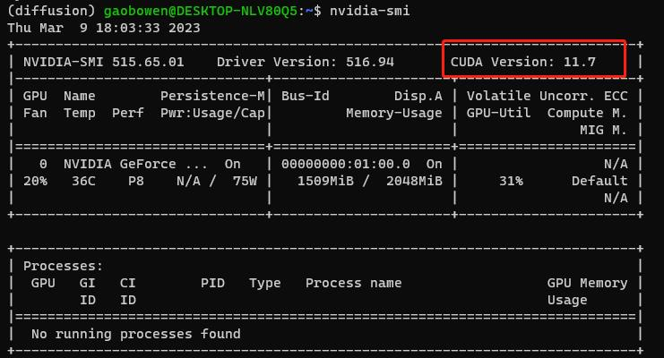
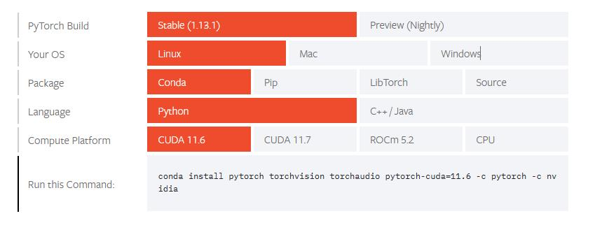

安装python3.11环境
```
conda create -n diffusion python=3.9
```
```
conda activate diffusion
```
输入 ```nvidia-smi``` 查看cuda版本



```
Linux version 5.4.0-1103-aws (buildd@lcy02-amd64-028) (gcc version 7.5.0 (Ubuntu 7.5.0-3ubuntu1~18.04)) #111~18.04.1-Ubuntu
```

安装pyorch （https://pytorch.org/get-started/locally/）
选择 pytorch-cuda 的版本 不大于 nvidia cuda 版本即可

安装pytorch环境
```
conda install pytorch torchvision torchaudio pytorch-cuda=11.7 -c pytorch -c nvidia
```
