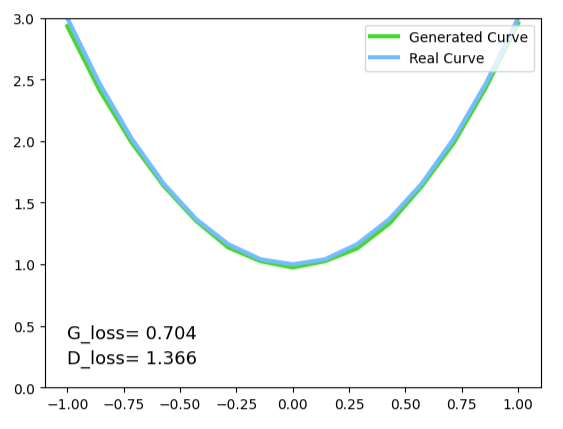

# Pytorch 实现 GAN 网络
## 原理
GAN的基本原理其实非常简单，假设我们有两个网络，G（Generator）和D（Discriminator）。它们的功能分别是：

G 是一个生成网络，它接收一个随机的噪声z，通过这个噪声生成伪造数据，记做 G(z)。

D 是一个判别网络，判别数据是不是“真实的”。它的输入参数是x，输出记为 D(x) 代表 x 为真实的概率。如果为 1 就代表 x 为真的概率是100%，而输出为 0 代表为真概率是0% 即为假。


在训练过程中，生成网络 G 的目标就是尽量生成真实的数据去欺骗判别网络D。而 D 的目标就是尽量把 G 生成的数据和真实的数据分别开来。这样，G 和 D 构成了一个动态的“博弈过程”。

最后博弈的结果是什么？在最理想的状态下，G可以生成足以“以假乱真”的数据 G(z) 。对于 D 来说，它难以判定 G 生成的数据究竟是不是真实的，因此 D(G(z)) = 0.5。

当判别器真假难辨时，D_fake，D_real->0.5，G_loss=log(1-0.5)=0.6931..., 此时 D_loss=log(1-0.5)+log(0.5) = 1.3832...

## 实现
这里我们的任务是：构造一个GAN网络，希望 生成器 能够输入噪声生成一个二次函数曲线


```py
import torch
import torch.nn as nn
import matplotlib.pyplot as plt
import numpy as np

BATCH_SIZE = 64
G_IN_SIZE = 15 #生成器 输入尺寸
G_OUT_SIZE = 15 #生成器 输出尺寸

PAINT_POINTS = np.vstack([np.linspace(-1,1, G_OUT_SIZE) for _ in range(BATCH_SIZE)]) #shape (BATCH_SIZE, G_OUT_SIZE)

plt.plot(PAINT_POINTS[0], 2 * np.power(PAINT_POINTS[0], 2) + 1, c='#74BCFF', lw=3, label='Real Curve')    #2 * x^2 + 1
plt.legend(loc='upper right') #标签位置
plt.show()
```


```py
# 准备真实数据
def real_points():
    paints = 2 * np.power(PAINT_POINTS,2) + 1
    paints = torch.from_numpy(paints).float()
    return paints

#定义网络
G = nn.Sequential(
    nn.Linear(G_IN_SIZE,128),
    nn.ReLU(),
    nn.Linear(128,G_OUT_SIZE)
)

D = nn.Sequential(
    nn.Linear(G_OUT_SIZE,128),
    nn.ReLU(),
    nn.Linear(128,1),
    nn.Sigmoid()            #0为False，1为True  D的评估应该是在【0-1】之间的数值，所以这里采用的是Sigmod激活
)

# 优化函数
optimizer_G = torch.optim.Adam(G.parameters(),lr=0.0001)
optimizer_D = torch.optim.Adam(D.parameters(),lr=0.0001)

bceloss = nn.BCELoss()

#训练
for step in range(10001):
    real_data = real_points() # 生成真实数据
    # print('real_data', real_data.shape)
    randn_input = torch.randn(BATCH_SIZE, G_IN_SIZE) #输入噪声
    # print('randn_input', randn_input.shape)

    eps = 1e-6  #防止log 0
    
    D_real = D(real_data) # 0为False，1为True，这里输入真实数据，D_real越靠近1越好
    D_fake = D(G(randn_input))
    
    #训练判别器D，根据公式 D_loss 分为两个部分：判断真实数据 log(1-D_real)；判断假数据 log(D_fake) 
    # D带着G一起更新，使用D(G(input))
    # D_loss = -torch.mean(torch.log(eps + 1.0 - D_real) + torch.log(eps + D_fake))
    D_loss = bceloss(1-D_real, torch.ones_like(D_real)) + bceloss(1-D_fake, torch.zeros_like(D_fake))
    
    optimizer_D.zero_grad()
    D_loss.backward()
    optimizer_D.step()

    #训练生成器G
    G_fake_out = G(randn_input) # 生成器生成假数据
    D_fake = D(G_fake_out) # 用判别器判别假数据，最好能让判别器判断概率趋近0.5，即生成器生成的假数据，能让判别器真假难辨
    # G的损失 越接近1越好，当D_fake->0.5时，G_loss=log(1-0.5)=0.6931..., 此时 D_loss=log(1-0.5)+log(0.5)= 1.3832...
    # G_loss = -torch.mean(torch.log(1.0 - D_fake + eps))
    G_loss = bceloss(D_fake, torch.zeros_like(D_fake))
    
    optimizer_G.zero_grad()
    G_loss.backward() #反向
    optimizer_G.step() #更新G参数
        
    if step % 1000 == 0:  # plotting
        plt.cla()
        plt.plot(PAINT_POINTS[0], G_fake_out.data.numpy()[0], c='#4AD631', lw=3, label='Generated Curve',)
        plt.plot(PAINT_POINTS[0], 2 * np.power(PAINT_POINTS[0], 2) + 1, c='#74BCFF', lw=3, label='Real Curve')
        plt.text(-1.0, 0.4, 'G_loss= %.3f ' % G_loss.data.numpy(), fontdict={'size': 13})
        plt.text(-1.0, 0.2, 'D_loss= %.3f ' % D_loss.data.numpy(), fontdict={'size': 13})
        plt.ylim((0, 3));plt.legend(loc='upper right', fontsize=10);plt.draw();plt.pause(0.1)

```


## GAN网络的损失函数
另外的，GAN网络的损失函数也可以使用 BCELoss(Binary Cross Entropy Loss) 或 BCEWithLogitsLoss  
BCELoss的解释如下：  

为了解决无穷的问题，当log小于-100时，固定输出-100.

reduction 默认 mean，x 为 D预测值，y 为实际值(0, 1)，则有 loss(x, y) = - mean(y * log(x) + (1-y) * log(1-x))  
又因 $x\in(0,1)$ 所以 log(x)<0, log(1-x)<0, mean前加上负号，使得 loss(x, y) > 0

**由图一公式 $ \mathop{min}\limits_{G}\mathop{max}\limits_{D} V(G,D)=E_{x \sim real}[log(D(x))]+E_{z \sim noize}[log(1-D(G(z)))]$ 可知, G 的 目标越小越好, D 的 目标越大越好。**


<!-- **G 为什么是越小越好？**
我们设计的目标是为了 生成器G 生成的数据 G(z)，尽可能的靠近真实数据, $ D(G(z)) \nearrow 1 $ 时，$E_{z \sim noize}[log(1-D(G(z)))] \searrow $


**D 为什么是越大越好？** -->


只对G网络计算loss时，G_loss 越小越好, G 网络生成的全是假数据，则x=D(G(z)), y=0，G_loss = BCELoss(x, 0) = -mean(log(1-D(G(z))))


对D网络计算loss时，D_Loss越大越好，而 $x\in(0,1)$, 所以可以令 $x_k=1-x$ 把越大越好问题 转化成 越小越好的问题。  
输入分两种情况：
- D输入G生成的假数据时 x=D(G(z))，x1=1-D(G(z)),  y1=0, D_loss_1 = BCELoss(x1, y1) = -mean(log(1-x1)) = -mean(log(D(G(z))))
- D输入真实数据时 x=D(k)，x2=1-D(k), y2=1, D_loss_2 = BCELoss(x2, y2) = -mean(log(1-D(k)))

D的总损失 D_Loss = - mean(log(1-D(k)) + log(D(G(z)))) = BCELoss(1-D(G(z)), 0) + BCELoss(1-D(k), 1)

可以用 bceloss 进行替换
```python
# G_loss = -torch.mean(torch.log(1.0 - D_fake + eps))
G_loss = bceloss(D_fake, torch.zeros_like(D_fake))

# D_loss = -torch.mean(torch.log(eps + 1.0 - D_real) + torch.log(eps + D_fake))
D_loss = bceloss(1-D_real, torch.ones_like(D_real)) + bceloss(1-D_fake, torch.zeros_like(D_fake))
```

