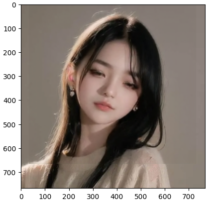
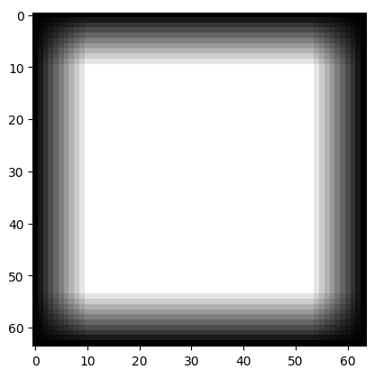
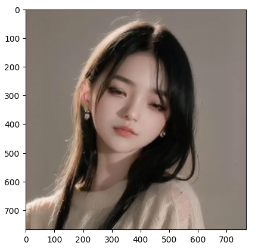

# 基于加权平滑过渡的无缝拼接

## 背景
在做语音驱动数字人视频生成的时候，为了达到快速响应实时播放的需求，即视频的生成速度 必须小于 音频的播放速度。
因此，我们截取了一部分较小的可动区域进行推理生成，然后把生成的图像贴回到原区域。  
通常情况下，推理生成图像的 清晰度和色彩 对比 原图 有些许差异，这样导致贴图后的图像区域有明显的边界感和分割感。  如下图所示：


## 方案选取
最开始我们想到 cv2.seamlessClone 贴回原区域后效果非常不错，能有效的消除边界，但是有个致命缺陷：不支持GPU加速，单帧的处理速度超过40ms。
也试过其他的机器学习融合算法都有速度慢的缺陷。
因此，为了能达到最快的单帧处理速度，我们采用最为朴素的加权平滑过渡方案，并且把运算放在GPU中。

## 实现
加权平滑过渡，越靠近边缘 底图的权重 越高；越靠近中心 贴图的权重越高。可以设计这样一个mask矩阵，权重从边缘到中心平滑过渡，贴图的时候直接相乘即可。
```py
# h:高，w:宽，d:过渡距离
def create_mask(h, w, d):
    mask = torch.full((h,w),fill_value=1.0)
    
    step = 1.0 / d
    range_1 = torch.arange(0, 1, step).reshape(1, d)
    range_2 = torch.reshape(range_1, (d, 1))
    range_3 = torch.fliplr(range_1)
    range_4 = torch.flipud(range_2)
    
    mask[:h, :d] *= range_1 # left
    mask[:d, :w] *= range_2 # top
    mask[:h, w-d:w] *= range_3 # right
    mask[h-d:h, :w] *= range_4  # bottom
    
    return mask
```


后续实现  
```py
import time
import cv2
import torch
import numpy as np
import matplotlib.pyplot as plt


center_x = 382
center_y = 333
# 贴图坐标和宽高
x = int(382-(698/2))
y = int(333-(667/2))
r_w = 698
r_h = 667

# 原图
full = cv2.imread("9638fa56.png")
full = cv2.cvtColor(full, cv2.COLOR_BGR2RGB)
full = np.transpose(full, [2, 0, 1]).astype(np.float16) # h w c -> c h w
full = torch.from_numpy(full).to('cuda')

# 贴图区域
copy_area = full[:,y:r_h+y,x:r_w+x]
print('copy_area', copy_area.shape)

# 贴图
head = np.load('head.npy')
head = cv2.resize(head, (r_w, r_h))
head = np.transpose(head, [2, 0, 1]).astype(np.float16) # h w c -> c h w
head = torch.from_numpy(head).to('cuda')
print('head', head.shape)

# mask矩阵 
h = head.shape[1]
w = head.shape[2]
d = int( w / 9 )
mask_head = create_mask(h, w, d).to('cuda')
mask_src = 1-mask_head


# 加权融合
t0 = time.time()
mix = None
for idx in range(1):
    head[0,:,:] *= mask_head
    head[1,:,:] *= mask_head
    head[2,:,:] *= mask_head
    
    copy_area[0,:,:] *= mask_src
    copy_area[1,:,:] *= mask_src
    copy_area[2,:,:] *= mask_src
    
    mix = head + copy_area

print('cost=', (time.time()-t0))

# 贴回原区域
full[:,y:r_h+y,x:r_w+x] = mix

full = np.transpose(full.data.cpu().numpy().astype(np.uint8), [1, 2, 0])
plt.imshow(full)
```
效果图


## 结论
加权平滑过渡的无缝拼接，能很好的消除贴图的边界和分割，并且单帧的处理速度在0.15ms左右（V100），满足实时数字人的生成需求。