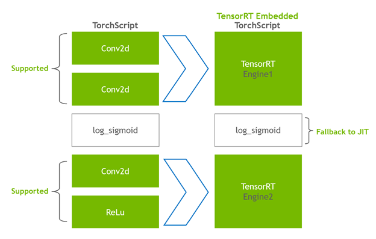
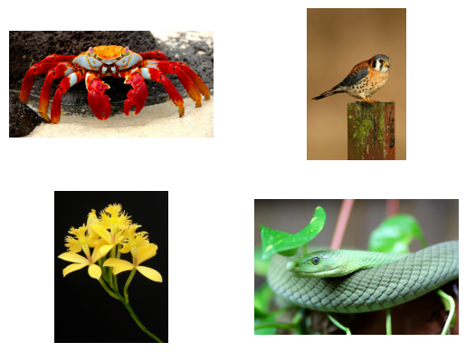
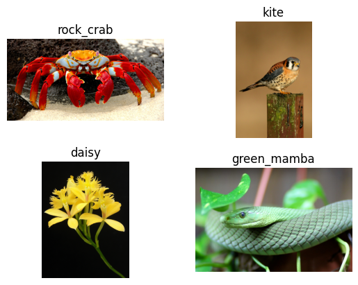

# 机器学习 - Torch-TensorRT 推理加速

Torch-TensorRT 作为 TorchScript 的扩展。 它优化并执行兼容的子图，让 PyTorch 执行剩余的图。 PyTorch 全面而灵活的功能集与 Torch-TensorRT 一起使用，解析模型并将优化应用于图的 TensorRT 兼容部分。

其中绿色部分是TensorRT支持的算子，白色的部分是不支持部分，则会在torch中兼容运算。  
如果希望整个程序都在 TensorRT 中运算，则需要用到 TensorRT API 和 CUDA Plugin。

## 环境准备
- 安装 docker (>=19.03)
- 安装 nvidia-docker
- 启动 TensorRT 环境镜像（推荐使用：nvcr.io/nvidia/pytorch:23.01-py3）
- 安装 torch-tensorrt

```py
!nvidia-smi

import torch
import tensorrt
import torch_tensorrt

print(torch.__version__)
print(torch.cuda.is_available())
print (tensorrt.__version__)
print (torch_tensorrt.__version__)
```
```
Tue Jul 11 02:11:17 2023       
+-----------------------------------------------------------------------------+
| NVIDIA-SMI 525.125.06   Driver Version: 525.125.06   CUDA Version: 12.0     |
|-------------------------------+----------------------+----------------------+
| GPU  Name        Persistence-M| Bus-Id        Disp.A | Volatile Uncorr. ECC |
| Fan  Temp  Perf  Pwr:Usage/Cap|         Memory-Usage | GPU-Util  Compute M. |
|                               |                      |               MIG M. |
|===============================+======================+======================|
|   0  Tesla T4            Off  | 00000000:00:1E.0 Off |                    0 |
| N/A   32C    P8     9W /  70W |      2MiB / 15360MiB |      0%      Default |
|                               |                      |                  N/A |
+-------------------------------+----------------------+----------------------+
                                                                               
+-----------------------------------------------------------------------------+
| Processes:                                                                  |
|  GPU   GI   CI        PID   Type   Process name                  GPU Memory |
|        ID   ID                                                   Usage      |
|=============================================================================|
|  No running processes found                                                 |
+-----------------------------------------------------------------------------+
1.14.0a0+44dac51
True
8.5.2.2
1.4.0dev0

```
```py
#准备数据（公开数据集下载4张测试图和分类信息）
!mkdir -p ./data
!wget  -O ./data/img0.JPG "https://inaturalist-open-data.s3.amazonaws.com/photos/8698/large.jpg"
!wget  -O ./data/img1.JPG "https://inaturalist-open-data.s3.amazonaws.com/photos/1697/large.jpg"
!wget  -O ./data/img2.JPG "https://inaturalist-open-data.s3.amazonaws.com/photos/7697/large.jpg"
!wget  -O ./data/img3.JPG "https://inaturalist-open-data.s3.amazonaws.com/photos/98797/large.jpg"

!wget  -O ./data/imagenet_class_index.json "https://s3.amazonaws.com/deep-learning-models/image-models/imagenet_class_index.json"
```

```py
from PIL import Image
from torchvision import transforms
import matplotlib.pyplot as plt
import json 

fig, axes = plt.subplots(nrows=2, ncols=2)

'''
图像进行预处理，加载后统一RGB通道，tensor(3, H, W)
缩放到统一尺寸，中心裁剪，将[0,255]像素值进行归一化处理
'''
for i in range(4):
    img_path = './data/img%d.JPG'%i
    img = Image.open(img_path)
    print(img)
    preprocess = transforms.Compose([
        transforms.Resize(256),
        transforms.CenterCrop(224),
        transforms.ToTensor(),
        transforms.Normalize(mean=[0.485, 0.456, 0.406], std=[0.229, 0.224, 0.225]),
    ])
    input_tensor = preprocess(img)
    print(input_tensor.shape)
    plt.subplot(2,2,i+1)
    plt.imshow(img)
    plt.axis('off')
```


```py
import torch
import torchvision


# 加载分类信息
with open("./data/imagenet_class_index.json") as json_file: 
    d = json.load(json_file)

torch.hub._validate_not_a_forked_repo=lambda a,b,c: True
#加载带权重ResNet模型
resnet50_model = torch.hub.load('pytorch/vision:v0.10.0', 'resnet50', weights=True)
resnet50_model.eval()
```

```py
import numpy as np
import time
import torch.backends.cudnn as cudnn
cudnn.benchmark = True

'''
图像进行预处理，加载后统一RGB通道，tensor(3, H, W)
缩放到统一尺寸，中心裁剪，将[0,255]像素值进行归一化处理
'''
#图片处理，固定输入尺寸 224x224
def rn50_preprocess():
    preprocess = transforms.Compose([
        transforms.Resize(256),
        transforms.CenterCrop(224),
        transforms.ToTensor(),
        transforms.Normalize(mean=[0.485, 0.456, 0.406], std=[0.229, 0.224, 0.225]),
    ])
    return preprocess

# 定义推理函数([predicted class, description], probability)
def predict(img_path, model, dtype='fp32'):
    img = Image.open(img_path)
    preprocess = rn50_preprocess()
    input_tensor = preprocess(img)
    if dtype=='fp16':
        input_tensor = input_tensor.half()
    #print(input_tensor.shape)
    input_batch = input_tensor.unsqueeze(0) #增加一个batch通道，torch.Size([1, 3, 224, 224])
    #print(input_batch.shape)
    
    if torch.cuda.is_available():
        input_batch = input_batch.to('cuda')
        model.to('cuda')

    with torch.no_grad():
        output = model(input_batch) #进行推理，得到1000个种类，torch.Size([1, 1000])
        #print('output',output.shape)
        sm_output = torch.nn.functional.softmax(output[0], dim=0) #torch.Size([1000])
        #print('sm_output',sm_output.shape)
        
    ind = torch.argmax(sm_output) #提取1000个种类中概率最高的类，index索引
    #d包涵了所有种类
    return d[str(ind.item())], sm_output[ind] #([predicted class, description], probability)


#测试推理是否正常
for i in range(4):
    img_path = './data/img%d.JPG'%i #模板字符串
    img = Image.open(img_path)
    
    pred, prob = predict(img_path, resnet50_model)
    print('{} - Predicted: {}, Probablility: {}'.format(img_path, pred, prob))

    plt.subplot(2,2,i+1)
    plt.imshow(img);
    plt.axis('off');
    plt.title(pred[1])

```
```py
#定义批量测试
def benchmark(model, input_shape=(1024, 1, 224, 224), dtype='fp32', nwarmup=50, nruns=10000):
    input_data = torch.randn(input_shape) #这里采用随机数不是真实图片
    input_data = input_data.to("cuda")
    if dtype=='fp16':
        input_data = input_data.half()
        
    print("Warm up ...")
    with torch.no_grad():
        for _ in range(nwarmup):
            features = model(input_data)
    torch.cuda.synchronize()
    print("Start timing ...")
    timings = []
    with torch.no_grad():
        for i in range(1, nruns+1):
            start_time = time.time()
            features = model(input_data)
            torch.cuda.synchronize()
            end_time = time.time()
            timings.append(end_time - start_time)
            if i%10==0:
                print('Iteration %d/%d, ave batch time %.2f ms'%(i, nruns, np.mean(timings)*1000))

    print("Input shape:", input_data.size())
    print("Output features size:", features.size())
    print('Average batch time: %.2f ms'%(np.mean(timings)*1000))
    
#进行测试
model = resnet50_model.eval().to("cuda")
benchmark(model, input_shape=(128, 3, 224, 224), nruns=100)
```
./data/img0.JPG - Predicted: ['n01978455', 'rock_crab'], Probablility: 0.943118691444397  
./data/img1.JPG - Predicted: ['n01608432', 'kite'], Probablility: 0.25734055042266846  
./data/img2.JPG - Predicted: ['n11939491', 'daisy'], Probablility: 0.3214719891548157  
./data/img3.JPG - Predicted: ['n01749939', 'green_mamba'], Probablility: 0.9004988670349  



```py
#定义批量测试
def benchmark(model, input_shape=(1024, 1, 224, 224), dtype='fp32', nwarmup=50, nruns=10000):
    input_data = torch.randn(input_shape) #这里采用随机数不是真实图片
    input_data = input_data.to("cuda")
    if dtype=='fp16':
        input_data = input_data.half()
        
    print("Warm up ...")
    with torch.no_grad():
        for _ in range(nwarmup):
            features = model(input_data)
    torch.cuda.synchronize()
    print("Start timing ...")
    timings = []
    with torch.no_grad():
        for i in range(1, nruns+1):
            start_time = time.time()
            features = model(input_data)
            torch.cuda.synchronize()
            end_time = time.time()
            timings.append(end_time - start_time)
            if i%10==0:
                print('Iteration %d/%d, ave batch time %.2f ms'%(i, nruns, np.mean(timings)*1000))

    print("Input shape:", input_data.size())
    print("Output features size:", features.size())
    print('Average batch time: %.2f ms'%(np.mean(timings)*1000))
    
#进行测试
model = resnet50_model.eval().to("cuda")
benchmark(model, input_shape=(128, 3, 224, 224), nruns=100)
```
//---------------------fp32---------------------------//  
Warm up ...  
Start timing ...  
Iteration 10/100, ave batch time 331.21 ms  
Iteration 20/100, ave batch time 331.77 ms  
Iteration 30/100, ave batch time 332.27 ms  
Iteration 40/100, ave batch time 332.61 ms  
Iteration 50/100, ave batch time 332.98 ms  
Iteration 60/100, ave batch time 333.25 ms  
Iteration 70/100, ave batch time 333.58 ms  
Iteration 80/100, ave batch time 333.87 ms  
Iteration 90/100, ave batch time 334.19 ms  
Iteration 100/100, ave batch time 334.49 ms  
Input shape: torch.Size([128, 3, 224, 224])  
Output features size: torch.Size([128, 1000])  
Average batch time: 334.49 ms  
//---------------------fp16---------------------------//  
Warm up ... 
Start timing ...  
Iteration 10/100, ave batch time 149.22 ms  
Iteration 20/100, ave batch time 149.37 ms  
Iteration 30/100, ave batch time 149.38 ms  
Iteration 40/100, ave batch time 149.46 ms  
Iteration 50/100, ave batch time 149.51 ms  
Iteration 60/100, ave batch time 149.58 ms  
Iteration 70/100, ave batch time 149.63 ms  
Iteration 80/100, ave batch time 149.69 ms  
Iteration 90/100, ave batch time 149.78 ms  
Iteration 100/100, ave batch time 149.84 ms 
Input shape: torch.Size([128, 3, 224, 224]) 
Output features size: torch.Size([128, 1000]) 
Average batch time: 149.84 ms 


## 下面测试 torch_tensorrt
```py
#定义input数据类型和输入尺寸
myinputs = [
    torch_tensorrt.Input( #动态尺寸，这里使用动态batch会报错
        min_shape=[1, 3, 224, 224],
        opt_shape=[1, 3, 224, 224],
        max_shape=[1, 3, 224, 224],
        dtype=torch.float32
    )
]
myinputs = [
    torch_tensorrt.Input( #固定的输入尺寸
        [128, 3, 224, 224],
        dtype=torch.float32
    )
]
myinputs = [
    torch.randn((1, 3, 224, 224),dtype=torch.float16) #通过输入tensor直接推测
]

enabled_precisions = {torch.float32, torch.float16} 

model = resnet50_model.eval()

# 将 torch model 转成 tensorrt model
trt_model = torch_tensorrt.compile(model, inputs = myinputs, enabled_precisions = enabled_precisions)

print(trt_model)
```
RecursiveScriptModule(original_name=ResNet_trt)  

```py
#测试推理是否正常
for i in range(4):
    img_path = './data/img%d.JPG'%i #模板字符串
    img = Image.open(img_path)
    
    pred, prob = predict(img_path, trt_model, dtype='fp16') #这里使用 trt_model
    print('{} - Predicted: {}, Probablility: {}'.format(img_path, pred, prob))

    plt.subplot(2,2,i+1)
    plt.imshow(img);
    plt.axis('off');
    plt.title(pred[1])
```
./data/img0.JPG - Predicted: ['n01978455', 'rock_crab'], Probablility: 0.9439687728881836  
./data/img1.JPG - Predicted: ['n01608432', 'kite'], Probablility: 0.2584533393383026  
./data/img2.JPG - Predicted: ['n11939491', 'daisy'], Probablility: 0.32035374641418457  
./data/img3.JPG - Predicted: ['n01749939', 'green_mamba'], Probablility: 0.9019732475280762  

```py
myinputs = [
    torch.randn((128, 3, 224, 224),dtype=torch.float16) #通过输入tensor直接推测
]

enabled_precisions = {torch.float32, torch.float16}

model = resnet50_model.eval()

trt_model_fp16 = torch_tensorrt.compile(model, inputs = myinputs, enabled_precisions = enabled_precisions)

print(trt_model_fp16)

#进行性能测试
benchmark(trt_model_fp16, input_shape=(128, 3, 224, 224), dtype='fp16', nruns=100)
```
RecursiveScriptModule(original_name=ResNet_trt)  
Warm up ...  
Start timing ...  
Iteration 10/100, ave batch time 59.09 ms  
Iteration 20/100, ave batch time 59.67 ms  
Iteration 30/100, ave batch time 59.72 ms  
Iteration 40/100, ave batch time 60.00 ms  
Iteration 50/100, ave batch time 60.27 ms  
Iteration 60/100, ave batch time 60.18 ms  
Iteration 70/100, ave batch time 60.36 ms  
Iteration 80/100, ave batch time 60.35 ms  
Iteration 90/100, ave batch time 60.38 ms  
Iteration 100/100, ave batch time 60.45 m  
Input shape: torch.Size([128, 3, 224, 224])  
Output features size: torch.Size([128, 1000])   
Average batch time: 60.45 ms  

由此可以得出结论，不对模型做其他改动，在使用 半精度 + torch_tensorrt 的情况下，有5倍多的提升。
同样使用半精度，使用torch_tensorrt后相较于原模型也有1倍多的提升。

参考文献：
https://pytorch.org/TensorRT/_notebooks/dynamic-shapes.html