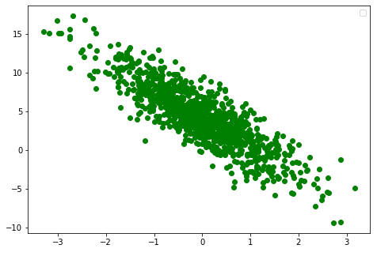

# 机器学习 01-线性回归
## 简介
本章通过机器学习从一批随机样本中找到一条直线，并且让这条直线尽可能拟合样本中的所有数据点。

以 $y=Xw+b+ϵ$ 为例，令 $w=[2,−3.4]^⊤$ 、$b=4.2$ 、ϵ为噪声项

整个训练步骤大致分成如下几个步骤：
1. **准备数据集**
2. **定义模型 和 初始化参数**
3. **定义损失函数**
4. **定义优化算法**
5. **训练**

之后的其他模型都依照此流程来进行。

#### 1. 准备数据集
```py
import torch
import torchvision
import random

def synthetic_data(w, b, num_examples):
    """生成y=Xw+b+噪声"""
    X = torch.normal(0, 1, (num_examples, len(w)))
    y = torch.matmul(X, w) + b
    y += torch.normal(0, 0.01, y.shape)
    return X, y.reshape((-1, 1))
        
                        
true_w = torch.tensor([2, -3.4])
true_b = 4.2
features, labels = synthetic_data(true_w, true_b, 1000)
print(features.shape) # torch.Size([1000, 2]) 1000份样本
print(labels.shape) # torch.Size([1000, 1])
```
```py
import matplotlib.pyplot as plt
fig=plt.figure()
#添加绘图区域
ax=fig.add_axes([0,0,1,1])

ax.scatter(features[:, (1)].detach().numpy(),labels.detach().numpy(), color='g',label="")

#添加图例
plt.legend(loc='best')
plt.show()
```

```py
#读取数据集
def data_iter(batch_size, features, labels):
    # 获取样本总数
    num_examples = len(features)
    # 获取样本下标
    indices = list(range(num_examples))
    # 随机打乱下标
    random.shuffle(indices)
    for i in range(0, num_examples, batch_size): # 从 0 到 num_examples，步长为 batch_size，开始遍历
        batch_indices = torch.tensor(
            indices[i: min(i + batch_size, num_examples)]) # 得到 i ~ i + batch_size 的一批 下标
        yield features[batch_indices], labels[batch_indices]
        

for X, y in data_iter(5, features, labels):
    print(X, '\n', y)
    break

'''
tensor([[-0.0717, -0.8476],
        [ 0.6219,  1.7964],
        [-0.7212,  0.8185],
        [-0.1816,  0.5797],
        [-1.7331, -0.8054]]) 
 tensor([[ 6.9407],
        [-0.6599],
        [-0.0391],
        [ 1.8669],
        [ 3.4766]])
'''
```

#### 2. 定义模型 和 初始化参数
```py
"""线性回归模型"""
def linreg(X, w, b): 
    return torch.matmul(X, w) + b

w = torch.normal(0, 0.01, size=(2,1), requires_grad=True) # Xw = 1x2 * 2x1 = 1x1
b = torch.zeros(1, requires_grad=True)
w , b
```

#### 3. 定义损失函数
```py
def squared_loss(y_hat, y):
    """均方损失"""
    return (y_hat - y.reshape(y_hat.shape)) ** 2 / 2
```

#### 4. 定义优化算法
```py
def sgd(params, lr, batch_size):
    """小批量随机梯度下降"""
    with torch.no_grad():
        for param in params: #params = [w, b] 这里分别更新
            param -= lr * param.grad / batch_size  # 梯度下降, backward()后反向求导的梯度记录在grad中
            param.grad.zero_() 
            
```

#### 5. 训练
```py
lr = 0.03           #学习率
num_epochs = 3      #整个数据集 分成 3批次 
batch_size = 10     #每个批次 包涵 10个样本
net = linreg        #定义模型：这里是线性模型
loss = squared_loss #损失函数：用于评价 模型预测值 与 真实值 之间的差距
optimizer = sgd     #优化函数：用于更模型新权重参数

for epoch in range(num_epochs):
    for X, y in data_iter(batch_size, features, labels):
        y_hat = net(X, w, b) # X为输入参数，[w, b]为模型权重，y_hat为模型预测值
        l = loss(y_hat, y)   # 通过预测值和真实值 计算X和y的小批量损失
        # 因为l形状是(batch_size,1)，而不是一个标量。
        # l中的所有元素被加到一起，后backward反向传播，得到关于[w,b]的梯度
        l.sum().backward()
        optimizer([w, b], lr, batch_size)  # 使用参数的梯度更新参数
    with torch.no_grad():
        train_l = loss(net(features, w, b), labels)
        print(f'epoch {epoch + 1}, loss {float(train_l.mean()):f}')
```
打印结果
```
epoch 1, loss 0.030828
epoch 2, loss 0.000104
epoch 3, loss 0.000049
```

## 基于pytorch的简洁实现
```py
from torch.utils import data
from torch import nn

# 超参数
num_epochs = 5

# 1. 准备数据
def load_array(data_arrays, batch_size, is_train=True):
    """构造一个PyTorch数据迭代器"""
    dataset = data.TensorDataset(*data_arrays)
    return data.DataLoader(dataset, batch_size, shuffle=is_train)

data_iter = load_array((features, labels), 10) # batch_size = 10

# 2. 定义模型 和 初始化参数
net = nn.Sequential(nn.Linear(2, 1))
net[0].weight.data.normal_(0, 0.01)
net[0].bias.data.fill_(0)

# 3. 定义损失函数
loss = nn.MSELoss() # nn.MSELoss损失函数 loss(x, y) = (x - y)^2

# 4. 定义优化算法
optimizer = torch.optim.SGD(net.parameters(), lr=0.03)

# 5. 训练
for epoch in range(num_epochs):
    for X, y in data_iter:
        l = loss(net(X) ,y)   #前向推导计算
        optimizer.zero_grad() #这里是循环，需要把之前的导数清零
        l.backward()          #反向求导
        optimizer.step()      #更新参数
    with torch.no_grad():
        l = loss(net(features), labels) #评价损失
        print(f'epoch {epoch + 1}, loss {l:f}')

```
打印结果
```
epoch 1, loss 0.000222
epoch 2, loss 0.000094
epoch 3, loss 0.000094
epoch 4, loss 0.000094
epoch 5, loss 0.000094
```


