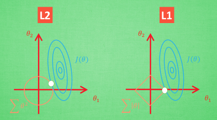

A为实对称矩阵, 则 $A^T=A$, $A$是$n\times n$方阵

平方矩阵 A 的迹线(Trace)定义：
$tr(A) =\sum\limits_{i=1}^{n}a_{ii} =a_{11}+a_{22}+\cdots+a_{nn}$
取对角线元素之和。  
例：  
$A=
\left[
\begin{array}{ccc}
1 & 2 & 3\\
4 & 5 & 6\\
7 & 8 & 9
\end{array}
\right]
$
则有 $tr(A)=a_{11}+a_{22}+a_{33}=1+5+9=15$

$det(A)$ 表示取 $A$ 的行列式

矩阵$A$的共轭转置 $A^*$或者$A^H$ 的定义为:$A^*=(\overline{A})^T=\overline{A^T}$。 
$\overline{A}$表示对矩阵$A$中的元素取复共轭。  
某些情况下$A^*$也指仅对矩阵元素取复共轭，而不做矩阵转置，切勿混淆。  
例如，量子力学中使用$A^\dag$表示共轭转置，而$A^*$只表示取复数共轭。  
$A=
\left[
\begin{array}{cc}
3+i & 5\\
2-2i & i
\end{array}
\right]$
$\overline{A}=
\left[
\begin{array}{cc}
3-i & 5\\
2+2i & -i
\end{array}
\right]$
${A^*}=
\left[
\begin{array}{cc}
3-i & 2+2i\\
5 & -i
\end{array}
\right]$  
如果A的元素是实数，那么$A^*$与A的转置$A^T$相等。  
$x$是一个列向量($[x_1,x_2,\cdots,x_n]^T$)而$x^*$表示其共轭转置。  
$x$的内积则为 $x^*x=x_1^2+x_2^2+\cdots+x_n^2$

#### 范数(norm)

L1范数（绝对值范数）: $||x||=|x_1|+|x_2|+\cdots+|x_n|$  
曼哈顿距离(L1-距离)：$d(x,y)=|x_1-x_2|+|y_1-y_2|$

L2范数（欧几里德范数）：$||x||_2= \sqrt{x^*x} = \sqrt{x_1^2+x_2^2+\cdots+x_n^2}$

$\infty$范数：$||x||_\infty=\mathop{max}\limits_i{|x_i|}$

#### 深度学习使用的范数

  
蓝色的圆心是误差最小的地方

L1 的方法, 我们很可能得到的结果是只有 $\theta_1$ 的特征被保留。  
L1 正则化来挑选对结果贡献最大的重要特征，但 L1 的结果并不是稳定的

L1和L2的比较：  
（1）鲁棒性（Robustness）：  
概括起来就是L1对异常点不太敏感，而L2则会对异常点存在放大效果。  
（2）稳定性：  
概括起来就是对于新数据的调整，L1的变动很大，而L2的则整体变动不大。  
（3）解决方案唯一性  
（L2-norm）是唯一的最短路径。  
（4）内置的特征选择（Built-in feature selection）：  
这是L1-norm经常被提及的一个优点，而L2-norm没有。这实际上是L1-norm的一个结果，L1-norm往往会使系数变得稀疏（sparse coefficients）。

torch.nn.L1Loss  
torch.nn.MSE  

向量范数和矩阵范数（几种范数 norm 的简单介绍）  
https://blog.csdn.net/idiot5lie/article/details/121121949
